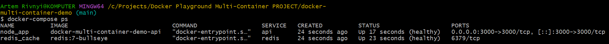
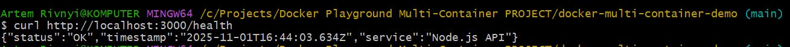
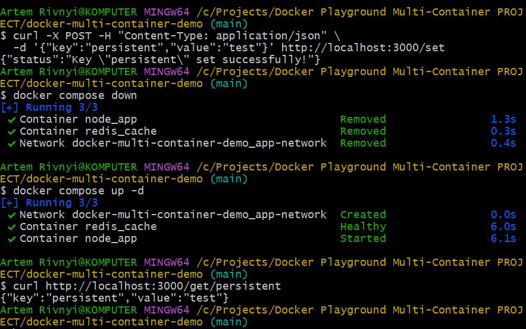

# 🐋 Docker Multi-Container Demo: Node.js + Redis

[](https://github.com/ArtemRivnyi/docker-multi-container-demo/actions/workflows/ci.yml )
[](https://hub.docker.com/r/dxrklxrd/docker-multi-container-demo )
[](https://hub.docker.com/r/dxrklxrd/docker-multi-container-demo )


[](https://opensource.org/licenses/MIT )
[](https://github.com/ArtemRivnyi/docker-multi-container-demo/commits/main )
[](https://github.com/ArtemRivnyi/docker-multi-container-demo/stargazers )

A professional multi-container Docker Compose setup demonstrating container orchestration, inter-service communication, and Redis caching in a cross-platform environment.

## 📖 Table of Contents

* [✨ Overview](#-overview)
* [🚀 Production Ready Checklist](#-production-ready-checklist)
* [🎯 What You'll Learn](#-what-youll-learn)
* [🚀 Quick Start](#-quick-start)
* [🏗️ Architecture & Data Flow](#%EF%B8%8F-architecture--data-flow)
* [🔧 How It Works](#-how-it-works)
  * [Docker Compose Orchestration](#docker-compose-orchestration)
  * [Service Dependencies & Health Checks](#service-dependencies--health-checks)
  * [Networking & Communication](#networking--communication)
  * [Data Persistence](#data-persistence)
* [📌 API Endpoints](#-api-endpoints)
* [🛠️ Installation & Usage](#%EF%B8%8F-installation--usage)
  * [Prerequisites](#prerequisites)
  * [Initial Setup](#initial-setup)
  * [Running the Application](#running-the-application)
  * [Using Makefile Commands](#using-makefile-commands)
* [⚙️ Continuous Integration (CI) with GitHub Actions](#-continuous-integration-ci-with-github-actions)
* [🧪 Testing](#-testing)
* [🌐 Cross-Platform Compatibility](#-cross-platform-compatibility)
* [📊 Monitoring & Logs](#-monitoring--logs)
* [🔐 Security Best Practices](#-security-best-practices)
* [🚨 Troubleshooting](#-troubleshooting)
* [🚀 Deployment Considerations](#-deployment-considerations)
* [🖼️ Screenshots](#%EF%B8%8F-screenshots)
* [📄 License](#-license)
* [🧰 Maintainer](#-maintainer)

---

## ✨ Overview

This repository provides a **production-ready template** for building and running multi-service applications using **Docker Compose**. It features a modern **Node.js (Express)** API server that uses **Redis** as an in-memory data store for caching and key-value operations.

**Key Highlights:**

- 🐳 **Multi-container orchestration** with Docker Compose

- 🔄 **Service health monitoring** with automatic restart policies

- 🌐 **Cross-platform compatibility** (Linux, macOS, Windows)

- 💾 **Data persistence** with Docker volumes

- 🔒 **Security best practices** (non-root user, minimal image)

- 📊 **Comprehensive logging** and error handling

---

## 🚀 Production Ready Checklist

This project is designed with production deployment in mind. Here is a checklist of best practices implemented:

| Feature | Status | Description |
| :--- | :--- | :--- |
| **Health Checks** | ✅ Implemented | Docker Compose waits for Redis to be healthy before starting the API, preventing race conditions. |
| **Non-Root User** | ✅ Implemented | The Node.js Dockerfile runs the application as a non-root user for enhanced security. |
| **Minimal Base Image** | ✅ Implemented | Uses a minimal base image (`node:20-alpine` or similar) to reduce attack surface and image size. |
| **Environment Variables** | ✅ Implemented | All configuration (ports, secrets) is managed via `.env` file and environment variables, following the **12 Factor App** principles. |
| **Logging** | ✅ Implemented | Application logs are written to `stdout`/`stderr`, allowing Docker to handle log aggregation. |
| **Restart Policy** | ✅ Implemented | `restart: unless-stopped` ensures containers automatically recover from unexpected failures. |
| **Volume Management** | ✅ Implemented | Uses named volumes for Redis data persistence, separating data from the container lifecycle. |
| **Automated Testing** | ✅ Implemented | CI pipeline is set up to run unit and integration tests automatically on every push. |
| **Graceful Shutdown** | ⚠️ To Be Confirmed | The Node.js server should handle `SIGTERM` signals for graceful shutdown, which is crucial for orchestration systems. (Requires code review in `api/server.js`). |

---

## 🎯 What You'll Learn

By exploring this project, you'll understand:

| Concept | Implementation in This Project |
| :--- | :--- |
| **Container Orchestration** | Docker Compose coordinates API and Redis services |
| **Service Discovery** | Containers communicate using service names (`redis`, `api`) |
| **Health Checks** | Ensures services are ready before accepting connections |
| **Volume Management** | Redis data persists across container restarts |
| **Network Isolation** | Services communicate via dedicated Docker bridge network |
| **Environment Configuration** | Uses `.env` file for flexible deployment |
| **Graceful Shutdowns** | Services handle SIGTERM signals properly |

---

## 🚀 Quick Start

### One-Line Start (After Prerequisites)

```bash
# Clone, configure, and launch
git clone <your-repo-url> && cd docker-multi-container-demo && \
cp .env.example .env && docker-compose up --build
```

### Test the API

```bash
# Check if API is responding
curl http://localhost:3000

# Store data in Redis
curl -X POST -H "Content-Type: application/json" \
  -d '{"key":"greeting","value":"Hello Docker!"}' \
  http://localhost:3000/set

# Retrieve data from Redis
curl http://localhost:3000/get/greeting
```

---

### File Descriptions

| File | Purpose | Key Features |
| :--- | :--- | :--- |
| `docker-compose.yml` | Orchestrates both services | Defines networks, volumes, health checks, dependencies |
| `.env.example` | Configuration template | Documents all available environment variables |
| `.env` | Active configuration | **You create this** - actual values used by Docker Compose |
| `api/Dockerfile` | API container blueprint | Single-stage build (Node.js 18), security hardening, health checks |
| `api/server.js` | API business logic | Express routes, comprehensive error handling, request logging |
| `api/redis-client.js` | Redis abstraction | Connection pooling, robust reconnection logic with exponential backoff, event handling |
| `Makefile` | Development shortcuts | Cross-platform commands for common tasks, including `test` and `clean` |
| `check-env.sh` | System validation | Verifies Docker, Docker Compose, daemon status, and system info |

---

## 🏗️ Architecture & Data Flow

### High-Level Architecture

```
┌──────────────────────────────────────────────────────────────┐
│                      Docker Host                             │
│  ┌────────────────────────────────────────────────────────┐  │
│  │            Docker Compose (app-network)                │  │
│  │                                                        │  │
│  │  ┌─────────────────┐         ┌──────────────────┐      │  │
│  │  │   Node.js API   │◄────────┤  Redis Cache     │      │  │
│  │  │   (Express)     │  Redis  │  (In-Memory DB)  │      │  │
│  │  │   Port: 3000    │ Client  │                  │      │  │
│  │  └────────┬────────┘         └────────┬─────────┘      │  │
│  │           │                           │                │  │
│  │           │                           │                │  │
│  │    Health Check                Volume Mount            │  │
│  │    (HTTP /health)            (redis_data:/data)        │  │
│  └────────────────────────────────────────────────────────┘  │
│           │                                                  │
│      Port Mapping                                            │
│      3000:3000                                               │
└───────────┼──────────────────────────────────────────────────┘
            │
            ▼
    ┌───────────────┐
    │    Client     │
    │  (Your App)   │
    └───────────────┘
```

### Request Flow Example

```
1. Client → POST /set {"key":"user:1","value":"John"}
   │
   ├─→ 2. Express receives request
   │      ├─→ Validates JSON body
   │      └─→ Logs request
   │
   ├─→ 3. Redis client.set('user:1', 'John')
   │      ├─→ Sends command over TCP (app-network)
   │      └─→ Redis stores in memory
   │
   └─→ 4. Response {"status":"Key set successfully!"}

5. Container restart → Redis loads data from /data (AOF persistence)
```

---

## 🔧 How It Works

### Docker Compose Orchestration

The `docker-compose.yml` file defines two services that work together:

```yaml
services:
  api:
    build: ./api                    # Build from local Dockerfile
    depends_on:
      redis:
        condition: service_healthy  # Wait for Redis to be ready
    ports:
      - "${API_PORT}:3000"         # Expose API to host
    networks:
      - app-network                # Connect to shared network
    restart: unless-stopped        # Auto-restart on failure

  redis:
    image: "redis:7-bullseye"        # Pre-built Redis image (Debian-based)
    platform: linux/amd64      # Explicitly set architecture for Apple Silicon compatibility
    volumes:
      - redis_data:/data           # Persist data (AOF file)
    networks:
      - app-network                # Same network as API
    healthcheck:
      test: ["CMD", "redis-cli", "ping"]  # Verify Redis is responsive
```

**Key Points:**

- **Build vs Image**: API is built from source, Redis uses official image

- **Dependency Order**: API waits for Redis health check before starting

- **Restart Policy**: `unless-stopped` ensures services auto-recover from crashes

### Service Dependencies & Health Checks

#### Why Health Checks Matter

Without health checks, Docker Compose might start the API before Redis is ready, causing connection errors. Our configuration prevents this:

**Redis Health Check:**

```yaml
healthcheck:
  test: ["CMD", "redis-cli", "ping"]  # Returns PONG when ready
  interval: 30s      # Check every 30 seconds
  timeout: 10s       # Fail if no response in 10s
  retries: 3         # Mark unhealthy after 3 failures
  start_period: 20s  # Grace period during startup
```

**API Health Check:**

```yaml
healthcheck:
  test: ["CMD", "curl", "-f", "http://localhost:3000/health"]
  interval: 30s
  timeout: 10s
  retries: 3
  start_period: 40s  # Longer grace period (needs Redis + app init)
```

**Health Check Flow:**

```
1. Docker starts Redis container
2. Health check runs: redis-cli ping → PONG ✓
3. Redis marked as "healthy"
4. Docker starts API container (depends_on condition met)
5. API health check runs: curl /health → 200 OK ✓
6. Both services ready for traffic
```

### Networking & Communication

#### Docker Bridge Network

Docker Compose creates an isolated network (`app-network`) where containers can communicate using **service names as hostnames**:

```javascript
// In api/redis-client.js
const client = redis.createClient({
  socket: {
    host: 'redis',  // ← Service name from docker-compose.yml
    port: 6379
  }
});
```

**How DNS Resolution Works:**

1. API container looks up hostname `redis`

1. Docker's embedded DNS resolves `redis` → `172.18.0.3` (internal IP)

1. Connection established over private bridge network

1. **External clients cannot access Redis directly** (no port mapping)

#### Port Mapping

```yaml
ports:
  - "3000:3000"  # HOST_PORT:CONTAINER_PORT
```

- **Left side (3000)**: Port on your machine

- **Right side (3000)**: Port inside container

- Only the API is exposed to the host; Redis remains internal

### Data Persistence

#### Redis AOF (Append-Only File)

Redis is configured with `--appendonly yes` to persist data:

```yaml
  redis:
    image: "redis:7-bullseye"
    command: redis-server --appendonly yes  # Enable AOF
    platform: linux/amd64
    volumes:
      - redis_data:/data  # Mount volume to /data (AOF file)
```

**How It Works:**

1. Every write operation (SET, DEL, etc.) is logged to `appendonly.aof`

1. File is synced to disk (fsync) periodically

1. On restart, Redis replays the AOF to restore data

1. **Volume** **`redis_data`** survives container destruction

**Testing Persistence:**

```bash
# Set a key
curl -X POST -H "Content-Type: application/json" \
  -d '{"key":"persistent","value":"test"}' http://localhost:3000/set

# Stop containers
docker-compose down

# Start again (data should persist)
docker-compose up -d

# Verify data survived
curl http://localhost:3000/get/persistent  # → {"key":"persistent","value":"test"}
```

**⚠️ Volume Deletion:**

```bash
# This DELETES all Redis data permanently
docker-compose down -v  # -v flag removes volumes
```

---

## 📌 API Endpoints

| Method | Endpoint | Description | Request Body | Response Example |
| :--- | :--- | :--- | :--- | :--- |
| `GET` | `/` | API information and available endpoints | - | `{"message": "Hello from Dockerized Node.js API...", "endpoints": {...}}` |
| `GET` | `/health` | Service health check (used by Docker) | - | `{"status": "OK", "timestamp": "2025-10-24T...", "service": "Node.js API"}` |
| `POST` | `/set` | Store key-value pair in Redis | `{"key": "string", "value": "string"}` | `{"status": "Key \"username\" set successfully!"}` |
| `GET` | `/get/:key` | Retrieve value by key from Redis | - | `{"key": "username", "value": "john_doe"}` or `404` if not found |

### Detailed Examples

#### 1. Store Data (POST /set)

```bash
curl -X POST http://localhost:3000/set \
  -H "Content-Type: application/json" \
  -d '{"key":"user:1001","value":"Alice"}'
```

**Success Response (200):**

```json
{
  "status": "Key \"user:1001\" set successfully!"
}
```

**Error Response (400 - Missing Key/Value):**

```json
{
  "error": "Please provide both \"key\" and \"value\" in the JSON body."
}
```

**Error Response (500 - Redis Unavailable):**

```json
{
  "error": "Failed to set key in Redis",
  "details": "Connection to Redis failed"
}
```

#### 2. Retrieve Data (GET /get/:key)

```bash
curl http://localhost:3000/get/user:1001
```

**Success Response (200):**

```json
{
  "key": "user:1001",
  "value": "Alice"
}
```

**Error Response (404 - Key Not Found):**

```json
{
  "error": "Key \"user:1001\" not found."
}
```

#### 3. Health Check (GET /health)

```bash
curl http://localhost:3000/health
```

**Response (200):**

```json
{
  "status": "OK",
  "timestamp": "2025-10-24T14:30:00.123Z",
  "service": "Node.js API",
  "version": "1.0.0"
}
```

#### 4. Error Handling (404 Not Found)

If you try to access an undefined route:

```bash
curl http://localhost:3000/nonexistent/route
```

**Response (404):**

```json
{
  "error": "Endpoint not found",
  "message": "Route GET /nonexistent/route does not exist"
}
```

#### 5. Global Error Handler (500 Internal Server Error)

The API includes a global error handler for unhandled exceptions:

**Response (500):**

```json
{
  "error": "Internal server error",
  "message": "Something went wrong on our side. Please try again later."
}
```

---

## 🛠️ Installation & Usage

### Prerequisites

Before starting, ensure you have:

| Software | Minimum Version | Installation Guide |
| :--- | :--- | :--- |
| **Docker** | 20.10+ | [docs.docker.com/get-started](https://docs.docker.com/get-started) |
| **Docker Compose** | 1.29+ (or Docker Desktop) | [docs.docker.com/compose/install](https://docs.docker.com/compose/install) |
| **Git** | 2.0+ | [git-scm.com/downloads](https://git-scm.com/downloads) |
| **curl** | Any version | Pre-installed on most systems |

**Verify Installation:**

```bash
docker --version          # Should show: Docker version 24.x.x
docker-compose --version  # Should show: Docker Compose version 2.x.x
```

### Initial Setup

#### Step 1: Clone the Repository

```bash
git clone https://github.com/yourusername/docker-multi-container-demo.git
cd docker-multi-container-demo
```

#### Step 2: Create Environment Configuration

```bash
# Copy the example environment file
cp .env.example .env

# (Optional) Edit .env to customize ports or project name
nano .env  # or use your preferred editor
```

**Default** **`.env`** **Configuration:**

```
# API Service Configuration
API_PORT=3000

# Project Configuration
COMPOSE_PROJECT_NAME=redis-demo

# Redis Configuration
REDIS_PORT=6379

# Node.js Environment
NODE_ENV=production
```

**⚠️ Important:** Do NOT commit `.env` to version control (it's already in `.gitignore`)

#### Step 3: Verify Environment

Run the environment check script to ensure everything is ready:

```bash
# Make script executable (Linux/macOS)
chmod +x check-env.sh

# Run the check
./check-env.sh
```

**Expected Output:**

```
🔍 Docker Multi-Container Demo - Environment Check
==================================================

✅ Docker is installed: Docker version 24.0.6
✅ Docker Compose is installed: Docker Compose version v2.23.0
✅ Docker daemon is running
✅ .env file exists and is configured

💻 System Information:
   OS: Linux
   Architecture: x86_64
   Kernel: 5.15.0-91-generic

⏸️  Application containers are not running
   Run 'make up' or 'docker-compose up -d' to start

🎉 Environment check completed!
```

### Running the Application

#### Method 1: Docker Compose Commands (Recommended)

| Command | Description | When to Use |
| :--- | :--- | :--- |
| `docker-compose up --build` | Build images and start services (foreground) | First run or after code changes |
| `docker-compose up -d` | Start services in detached mode | Production-like running |
| `docker-compose down` | Stop and remove containers | When done testing |
| `docker-compose down -v` | Stop and **delete all data** | Complete cleanup |
| `docker-compose logs -f` | Follow real-time logs | Debugging |
| `docker-compose ps` | Show container status | Health monitoring |
| `docker-compose restart` | Restart all services | After config changes |

**First-Time Startup:**

```bash
docker-compose up --build
```

**Watch the logs:** You should see:

```
redis_cache  | ✅ Ready to accept connections
node_app     | 🔗 Connecting to Redis...
node_app     | ✅ Connected to Redis successfully!
node_app     | ✅ API server is running on port 3000
```

**Stop with:** `Ctrl+C` (or `docker-compose down` if running in detached mode)

#### Method 2: Using Makefile Commands

The `Makefile` provides convenient shortcuts:

```bash
# Start services in background
make up

# View logs in real-time
make logs

# Run API tests
make test

# Stop services
make down

# Complete cleanup (removes volumes!)
make clean

# Show available commands
make help
```

**Makefile Command Reference:**

| Command | Equivalent Docker Compose Command | Description |
| :--- | :--- | :--- |
| `make up` | `docker-compose up -d` | Start in detached mode |
| `make down` | `docker-compose down` | Stop and remove containers |
| `make build` | `docker-compose build --no-cache` | Rebuild images from scratch |
| `make test` | (custom script) | Run API connectivity tests |
| `make logs` | `docker-compose logs -f` | Follow service logs |
| `make clean` | `docker-compose down -v --remove-orphans` | Full cleanup |
| `make ps` | `docker-compose ps` | Show running containers |
| `make restart` | `docker-compose down && docker-compose up -d` | Restart services |

---

## ⚙️ Continuous Integration (CI) with GitHub Actions

Implementing CI is a critical step for a production-ready application. It ensures that every change to the code is automatically tested and verified.

### CI Workflow (`.github/workflows/ci.yml`)

The CI pipeline is configured to:
1.  Checkout the code.
2.  Install Node.js dependencies for the API service.
3.  Run unit tests (`npm test --prefix api`).
4.  Build the Docker images to ensure Dockerfiles are valid.
5.  Run integration tests by starting the full multi-container setup (`docker compose up -d`) and checking the API's health endpoint.

**Note:** The CI configuration uses the modern `docker compose` command (without a hyphen) for compatibility with the latest GitHub Actions runners.

---

## 🧪 Testing

### Automated Tests (Makefile)

```bash
make test
```

**What It Tests:**

- ✅ API is accessible on `http://localhost:3000`

- ✅ Health endpoint returns 200 OK

- ✅ Basic HTTP connectivity

### Manual Testing Suite

#### Test 1: API Connectivity

```bash
curl http://localhost:3000
```

**Expected:**

```json
{
  "message": "Hello from Dockerized Node.js API with Redis!",
  "timestamp": "2025-10-24T14:30:00.000Z",
  "endpoints": {
    "set": "POST /set - Set key-value pair in Redis",
    "get": "GET /get/:key - Get value by key from Redis",
    "health": "GET /health - Service health check"
  }
}
```

#### Test 2: Redis Integration (Write)

```bash
curl -X POST -H "Content-Type: application/json" \
  -d '{"key":"testkey","value":"testvalue"}' \
  http://localhost:3000/set
```

**Expected:**

```json
{
  "status": "Key \"testkey\" set successfully!"
}
```

#### Test 3: Redis Integration (Read)

```bash
curl http://localhost:3000/get/testkey
```

**Expected:**

```json
{
  "key": "testkey",
  "value": "testvalue"
}
```

---

## 🌐 Cross-Platform Compatibility

This project is designed to run seamlessly on any operating system that supports Docker, including:

- **Linux** (Ubuntu, Fedora, etc.)
- **macOS** (Intel and Apple Silicon via `platform: linux/amd64` explicit setting in `docker-compose.yml`)
- **Windows** (via Docker Desktop)

The use of Docker Compose abstracts away OS-specific dependencies, ensuring a consistent environment for development and production.

---

## 📊 Monitoring & Logs

All services are configured to log to `stdout` and `stderr`, which is the Docker standard for centralized logging.

**View Logs:**

```bash
# View all logs in real-time
docker-compose logs -f

# View logs for a specific service (e.g., the API)
docker-compose logs -f api
```

This approach allows external log aggregation tools (like ELK stack, Datadog, or cloud logging services) to easily collect and process the application logs.

---

## 🔐 Security Best Practices

The project incorporates several security best practices:

1.  **Non-Root User:** The `api/Dockerfile` ensures the Node.js application runs as a non-root user inside the container, minimizing potential damage in case of a security breach.
2.  **Minimal Base Image:** Using a slim base image (e.g., `node:20-alpine`) reduces the attack surface by including only essential packages.
3.  **Internal Redis:** The Redis service is not exposed to the host machine (no port mapping), making it inaccessible from outside the Docker network. Only the API container can communicate with it.
4.  **Environment Variables:** Sensitive configurations are managed via environment variables (`.env`), keeping them out of the source code.

---

## 🚨 Troubleshooting

| Issue | Error Message | Solution |
| :--- | :--- | :--- |
| **`docker-compose: command not found`** | `/bin/sh: 1: docker-compose: not found` | Your system is using the modern Docker CLI. Use `docker compose` (without the hyphen) instead of `docker-compose`. The `Makefile` is configured to handle this. |
| **API fails to start** | `Error: connect ECONNREFUSED 172.x.x.x:6379` | The API started before Redis was ready. This is usually prevented by `depends_on: service_healthy`. If it persists, check Redis logs (`docker-compose logs redis`) or increase `start_period` in the API's health check. |
| **`Address already in use`** | `Error: listen EADDRINUSE :::3000` | Another process on your host machine is already using port 3000. Change the `API_PORT` in your `.env` file (e.g., to 8080) and restart the services. |
| **Data not persisting** | Data is lost after `docker-compose down` | You likely used `docker-compose down -v`, which explicitly deletes volumes. Use `docker-compose down` (without `-v`) to stop containers while preserving data volumes. |
| **CI fails on `docker-compose`** | `command not found` | See the first solution. The CI workflow has been updated to use `docker compose`. Ensure you are using the latest `ci.yml`. |

---

## 🚀 Deployment Considerations

This multi-container setup is an excellent foundation for production deployment. For a real-world environment, consider these next steps:

1.  **Orchestration:** Migrate from Docker Compose (local development tool) to a full-fledged orchestrator like **Kubernetes** or **Docker Swarm**.
2.  **Secrets Management:** Use a dedicated secrets manager (e.g., Kubernetes Secrets, AWS Secrets Manager, HashiCorp Vault) instead of passing secrets via environment variables.
3.  **Registry:** Push your built API image to a private Docker registry (e.g., Docker Hub, AWS ECR, GitHub Packages) for reliable deployment.
4.  **Load Balancing:** Place a load balancer (e.g., Nginx, Traefik, cloud load balancer) in front of the API service to distribute traffic and handle SSL termination.

---

## 🖼️ Screenshots

*Note: This section is a placeholder. In a real-world scenario, you should generate and insert high-quality screenshots here to visually demonstrate the setup, the running containers, and the API interaction.*

| Description | Image |
| :--- | :--- |
| **Running Containers** |  |
| **API Health Check** |	 |
| **Data Persistence Test** |  |

---

## 🔮 Upcoming Changes (Feature Branches)

The following improvements are ready on feature branches and will be merged into `main` in the near future:

### `feature/enhanced-testing` — Test Coverage & CI

- **17 new integration tests** added (`api/__tests__/api.integration.test.js`)
  - 404 route handling (4 tests)
  - Redis error simulation — SET/GET failures → 500 responses (2 tests)
  - Input validation — empty body, missing key/value, special characters (4 tests)
  - Root endpoint structure, timestamps, content-type headers (7 tests)
- **Test coverage enabled** — `jest --coverage` (currently at **82.6%**)
- **CI pipeline updated** — `npm test` now runs on every push and PR (was previously commented out)
- Total: **23 tests** across 2 test suites, all passing ✅

### `feature/traefik-reverse-proxy` — Reverse Proxy & Load Balancing

- **Traefik v3.2** added as cloud-native reverse proxy (port **80** HTTP, port **8080** Dashboard)
- **API scaled to 3 replicas** with automatic Round Robin load balancing
- Port 3000 **no longer exposed** directly — traffic flows exclusively through Traefik
- Traefik health checks on `/health` ensure only healthy replicas receive traffic
- New file: `traefik.yml` — static Traefik configuration

---

## 📄 License

This project is licensed under the MIT License. See the [LICENSE](LICENSE) file for details.

---

## 🧰 Maintainer

**Artem Rivnyi** — Junior Technical Support / DevOps Enthusiast

* 📧 [artemrivnyi@outlook.com](mailto:artemrivnyi@outlook.com)  
* 🔗 [LinkedIn](https://www.linkedin.com/in/artem-rivnyi/)  
* 🌐 [Personal Projects](https://personal-page-devops.onrender.com/)  
* 💻 [GitHub](https://github.com/ArtemRivnyi)
