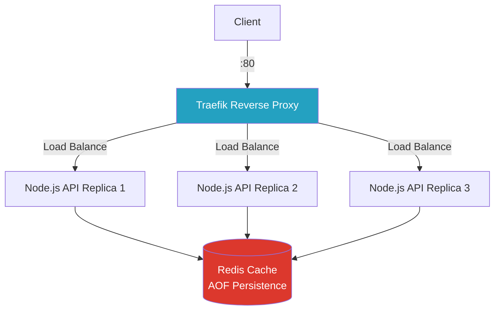

# 🐋 Docker Multi-Container Demo: Node.js + Redis

[](https://github.com/ArtemRivnyi/docker-multi-container-demo/actions/workflows/ci.yml)
[](https://hub.docker.com/r/dxrklxrd/docker-multi-container-demo)
[](https://hub.docker.com/r/dxrklxrd/docker-multi-container-demo)

<p align="left">
  
  
  
  
  
  
</p>

[](https://opensource.org/licenses/MIT)
[](https://github.com/ArtemRivnyi/docker-multi-container-demo/commits/main)

A **production-ready template** for multi-service Docker Compose applications. Features a Node.js (Express) API with Redis caching, health checks, auto-restart, data persistence, and full CI/CD pipeline.

---

## 🚀 Production Ready Checklist

| Feature | Status | Description |
| :--- | :--- | :--- |
| **Health Checks** | ✅ | Docker waits for Redis before starting the API |
| **Non-Root User** | ✅ | Container runs as unprivileged user |
| **Minimal Base Image** | ✅ | `node:20-alpine` for reduced attack surface |
| **Env Configuration** | ✅ | `.env`-based config (12 Factor App) |
| **Restart Policy** | ✅ | `unless-stopped` for auto-recovery |
| **Data Persistence** | ✅ | Named volumes for Redis AOF |
| **Automated Testing** | ✅ | CI runs unit + integration tests on every push |

---

## 🏗️ Architecture



---

## 🚀 Quick Start

```bash
# Clone, configure, and launch
git clone https://github.com/ArtemRivnyi/docker-multi-container-demo.git
cd docker-multi-container-demo
cp .env.example .env
docker-compose up --build
```

### Test the API

```bash
# Health check
curl http://localhost:3002/health

# Store a key
curl -X POST -H "Content-Type: application/json" \
  -d '{"key":"greeting","value":"Hello Docker!"}' \
  http://localhost:3002/set

# Retrieve it
curl http://localhost:3002/get/greeting
```

---

## 📌 API Endpoints

| Method | Endpoint | Description |
| :--- | :--- | :--- |
| `GET` | `/` | API info and available endpoints |
| `GET` | `/health` | Service health check (used by Docker) |
| `POST` | `/set` | Store key-value pair in Redis |
| `GET` | `/get/:key` | Retrieve value by key |

---

## ⚙️ CI with GitHub Actions

The pipeline automatically:
1. Installs Node.js dependencies
2. Runs unit tests (`npm test`)
3. Builds Docker images
4. Starts the full stack and runs integration tests against `/health`

---

## ☁️ Automated Deployment (Terraform + Ansible)

Includes full **Infrastructure as Code** for AWS EC2 deployment:

```bash
# 1. Provision infrastructure
cd terraform/ec2-deployment
terraform init && terraform apply -var="public_key=$(cat ~/.ssh/id_rsa.pub)"

# 2. Deploy the application
cd ../../ansible
ansible-playbook deploy.yml
```

---

## 🖼️ Screenshots

| Running Containers | API Health Check | Data Persistence |
| :--- | :--- | :--- |
|  |  |  |

---

## 📄 License

MIT License. See [LICENSE](LICENSE) for details.

## 🧰 Maintainer

**Artem Rivnyi** — DevOps Engineer

* 📧 [artemrivnyi@outlook.com](mailto:artemrivnyi@outlook.com)
* 🔗 [LinkedIn](https://www.linkedin.com/in/artem-rivnyi/)
* 🌐 [Personal Projects](https://personal-page-devops.onrender.com/)
* 💻 [GitHub](https://github.com/ArtemRivnyi)
